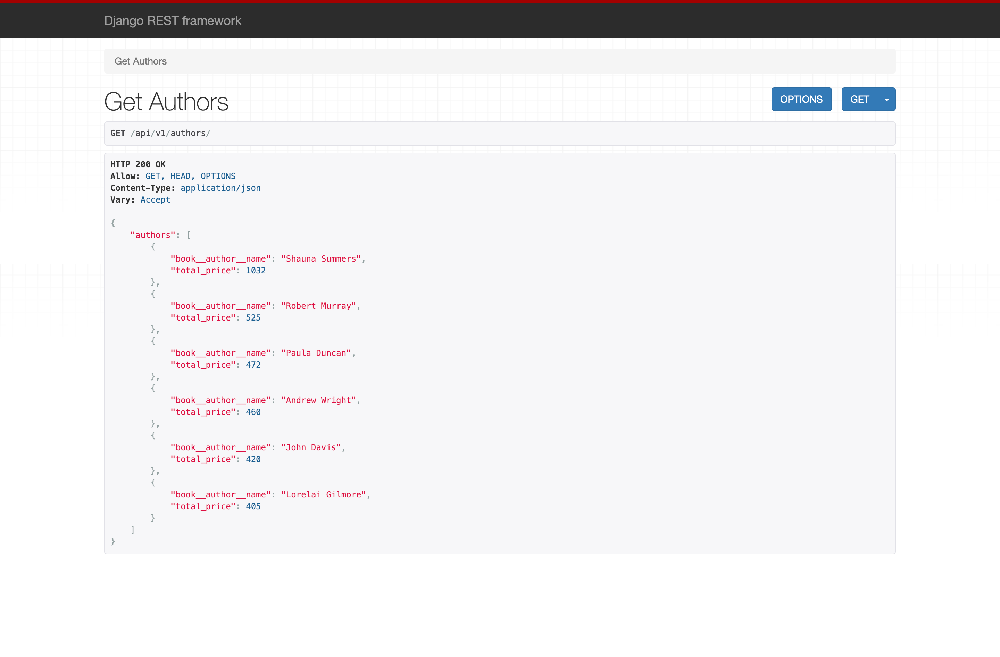

# Krikey Coding Challenge

## Contents:
1. Requirements
2. Steps to run the project
3. Load Data 
4. Landing Page
5. Endpoints
6. Code Explanation
7. Add more authors, books, salesitems

## Requirements

1. Docker Desktop 
2. Python3
3. PostgreSQL
4. Git

## Steps to run the project

### i. Create a new project in Google cloud platform and enable billing:

Sign in to the console and create a new project.
```
https://console.cloud.google.com
```
Make sure to enable billing by following the link down below.
```
https://cloud.google.com/billing/docs/how-to/modify-project?authuser=1
```

### ii. Install CloudSDK, Enable the Cloud SQL, and Compute Engine APIs:
> Install CloudSDK

Follow this link to install the required CloudSDK to your local system.
```
https://cloud.google.com/sdk/docs/install
```

> Installing the Cloud SQL Proxy

#### Download the Cloud SQL Auth proxy:

If you are using macOS 64-bit:
```
curl -o cloud_sql_proxy https://dl.google.com/cloudsql/cloud_sql_proxy.darwin.amd64
```
If you are using macOS 32-bit:
```
curl -o cloud_sql_proxy https://dl.google.com/cloudsql/cloud_sql_proxy.darwin.386
```

If you are using linux 64-bit:
```
wget https://dl.google.com/cloudsql/cloud_sql_proxy.linux.amd64 -O cloud_sql_proxy
```

If you are using linux 32-bit:
```
wget https://dl.google.com/cloudsql/cloud_sql_proxy.linux.386 -O cloud_sql_proxy
```

> Make the Cloud SQL Auth proxy executable:

```
chmod +x cloud_sql_proxy

```

### iii. Install PostgreSQL in your local system
If you use a Linux OS: 
```
sudo apt-get install postgresql

```
If you use a Mac OS:
```
brew install postgres

```
### iv. Start PostgreSQL server:

If you use a Linux OS: 
```
psql --host 127.0.0.1 --user postgres --password

```
If you use a Mac OS:
```
brew services start postgresql
```

### v. Clone the project
```
git clone https://github.com/vidhyasagar13/krikeyCodingChallenge.git
```

### vi. Initialize the image in the Google Clound Container Registry

#### v1(A). If Authenticated already, skip the step and go to vi(B).

Create a new service account key to authencticate you cloudSDK.
Run the following command or go to GUI to create a new key and download it.
```
gcloud iam service-accounts create key

PROJECT_ID=<PROJECT ID>
CLIENT_EMAIL=keys@<PROJECT ID>.iam.gserviceaccount.com
CLIENT_ID=$(gcloud iam service-accounts \
        describe keys@<PROJECT ID>.iam.gserviceaccount.com \
    --format 'value(uniqueId)')

```

This will create a new key.json file and store it in the directory which will look similar to this...

```
{
  "type": "service_account",
  "project_id": "<PROJECT_ID>",
  "private_key_id": "<PRIVATE_KEY_ID>",
  "private_key": "<PRIVATE_KEY>",
  "client_email": "<CLIENT_EMAIL>.gserviceaccount.com",
  "client_id": "<CLIENT_ID>",
  "auth_uri": "https://accounts.google.com/o/oauth2/auth",
  "token_uri": "https://oauth2.googleapis.com/token",
  "auth_provider_x509_cert_url": "https://www.googleapis.com/oauth2/v1/certs",
  "client_x509_cert_url": "https://www.googleapis.com/<CERT_URL>gserviceaccount.com"
}
```
After this, run the following to authenticate our CloudSDK.

```
gcloud auth activate-service-account \
  --key-file key.json
```

#### vi(B). Checks with cloudbuild.yaml
> Open `cloudbuild.yaml` file and replace the project_id with your project id created in the google cloud. Also, change the TAG NAME to a name you want.

> After replacing, run the following command.

```
gcloud builds submit .
```
Please take a note of the '.' in the end. It is very important. 
This step builds and pushes the image to google cloud container registry.


> The above step will build the docker image first with the docker-compose file. If you need to change the username and password of the postgreSQL database, you can change either directly there or by replacing them and giving it in the environment variable.

### vii. Initialize the cluster for deploying our created image. 
A cluster will be initialized using the cloudSDK with the number of nodes and certificates.

```
gcloud container clusters create <PROJECT ID OR WHATEVER NAME YOU WANT TO GIVE> --num-nodes 1 --issue-client-certificate --zone us-central1-a 
```

Once the cluster created, it will initialize Compute Engine and Virtual Machine instance as well which will serve as our cloud machine to host our API.
You can check `console.cloud.google.com/compute/instances`

### viii Apply the deployment.yml to create number of pods.   
Go to your Google Cloud console and take a note of your image tag. 

Like previous step, open `deployment.yml` and replace IMAGE TAG with the image tag that was displayed in your google cloud console.

> After replacing, run the following command

```
kubectl apply -f deployment.yml
```
The output will be similar to this
```
...... deployments created
```
### ix. Apply the service.yml to run the vm instance 

The above step would have created the necessary pods and given some time the pods will show `STATUS : READY`

To check this,

```
kubectl get pods --watch
```
The output will be similar to this
```
POD NAME                    READY    UPDATE       MESSAGE
<PROJECT ID> - <some-hash>   1/1     Up-To-Date   ....
<PROJECT ID> - <some-hash>   1/1     Up-To-Date   ....
<PROJECT ID> - <some-hash>   1/1     Up-To-Date   ....
```

Go to your Google Cloud console and take a note of your image tag. 

Like previous step, open `service.yml` and replace PROJECT ID with the PROJECT ID that was displayed in your google cloud console.

> After replacing, run the following command

```
kubectl apply -f service.yml
```
The output will be similar to this
```
...... services created
```

To check our services,
```
kubectl get services
```
The output will be similar to this...

```
SERVICE NAME                INTERNAL IP   EXTERNAL IP  ....
<PROJECT ID> - <some-hash>  10.34.21.54.  <pending>    .... 
```

> Here the internal IP is just a dummy IP address and it will be same for you.

> Given some time, the IP address will be shown. Open a new browser, and hit the external IP. 

Voila, now you've successfully deployed the website to GCP kubernetes cluster.

## Load Data

A static test data can be loaded using the loaddata method. Three `.json` files is stored in `dumpeddata/` directory.

Connect to the VM instance by SSH ing inside. This can be easily done using the gcloud GUI. Select SSH from the dropdown in the VM instances link.
Once connected, run the following command  

```
cd krikeyCodingChallenge
python manage.py createsuperuser
```
Follow the prompt.. and once it is done run the below commands
```
./manage.py loaddata authors.json
./manage.py loaddata books.json
./manage.py loaddata salesitems.json

```

## Landing Page
This is how the landing page should look like. 

 

## Endpoint #1
For the endpoint, please hit http://<EXTERNAL-IP>/api/v1/authors

> The external IP should be replaced with the external IP address that was obtained from the services.



## Endpoint #2
For the endpoint, please hit http://<EXTERNAL-IP>/api/v1/authors/?author=Lorelai%20Gilmore
Here, a specific author is given in the GET parameter.

 

## Endpoint #3
If the given author name is not available in the database, then a HTTP 404 will be thrown.


## Code Explanation

### Django Code

#### URLs

Take a look at the file `krikeyCodingChallenge/urls.py` where three urls are defined one for admin usage, one for api endpoints and one for landing page.

1. Admin usage - This can be used to add more authors, books and sale items.

2. API endpoints - Hit API app, which is created as a django-app in the same directory. This finds the defined urls inside `api/urls.py`. The defined pattern should have api in the start of resources.

3. Landing page - Hits the answers view inside `api/views.py`. The pattern defined should have no characters. 
 
Take a look at the file `api/urls.py` where there is only API endpoint pattern to serve the challenge purpose.

#### Views

Take a look at the file `api/views.py` where there is a APIView Instance created to provide REST API service.
This takes an optional author name and returns a JSON Response with the status code of the result. 

The JSON response will either be a list of top 10 authors names and sales revenue ordered by the sales revenue or when a author name is given the author's name and sales revenue is returned.
This will also return a 404 response, when an author name specified is not found in our database. 

The results are returned using raw postgreSQL queries and also I have commented out the Django ORM queries for future use cases.


#### Landing Page

The landing page has the solution for the SQL Challenge. The results are also shown in the table.
 

#### Deployment Code

*cloudbuild.yml*

The very first step is the `gcloud builds submit .`. This will look for the default file, this is the `cloudbuild.yml file`.

This file has the instructions step wise what to do before pushing the docker image to the container registry in google cloud.

The first step is building the image using docker. The docker tag is mentioned in the args parameter. This tag is then used in the gcloud container registry.
The next step is docker-compose and pushing the built docker image to container registry.

*Dockerfile*

Uses python:3 which takes the entire coding directory to code/ and installs the requirements by using requirements.txt file.

```
# syntax=docker/dockerfile:1
FROM python:3
ENV PYTHONUNBUFFERED=1
WORKDIR /code
COPY requirements.txt /code/
RUN pip install --no-cache-dir -r requirements.txt
COPY . /code/

```

*docker-compose.yml*

The compose file will run the command migrate to make any database schema changes and starts the server in the port 8080.
Initializes the postgres with the defined username, password. The port for postgres is given as 5432 and the port 8080 is exposed outside.
```
version: "3"

services:
  web:
    restart: always
    build: .
    command: python mange.py migrate && python manage.py runserver 0.0.0.0:8080
    volumes:
      - .:/code
    ports:
      - "8080:8080"
    expose:
      - 8080
    depends_on:
      - postgres

  postgres:
    image: postgres
    volumes:
      - ./data/db:/var/lib/postgresql/data
    environment:
      - PGDATA=/tmp
      - POSTGRES_DB=postgres
      - POSTGRES_USER=postgres
      - POSTGRES_PASSWORD=postgres
    ports:
      - "5432:5432"
```

*deployment.yml*

Retrives the pushed image and set ups the cluster pod with the defined port numbers.

```
apiVersion: apps/v1
kind: Deployment
metadata:
  name: <PROJECT ID>
spec:
  replicas: 3
  selector:
    matchLabels:
      app: <PROJECT ID>
  template:
    metadata:
      labels:
        app: <PROJECT ID>
    spec:
      containers:
      - name: <PROJECT ID>
        image: gcr.io/<PROJECT ID>/gcb-docker-compose:latest
        ports:
        - containerPort: 8080
        env:
          - name: PORT
            value: "8080"
```

*service.yml*

By specifying the type as a 'LoadBalancer', Container Engine will create an external HTTP load balancer.
The port 80 is mapped to port 8080 so that whenever the external IP is hit, it gets re-routed to port number 8080.

```
apiVersion: v1
kind: Service
metadata:
  name: <PROJECT ID>
spec:
  type: LoadBalancer
  selector:
    app: <PROJECT ID>
  ports:
  - port: 80
    targetPort: 8080

```
#### Add more authors, books and saleitems

Go to a browser and hit http://<EXTERNAL-IP>/admin

The page should look like,


> Login using the username, password that was used when creating a super user.

Once logged in, the GUI will be super intutive to add new authors, books, salesitems. 
Attached images for understanding...


Any one of the tables can be selected from the list here. http://<EXTERNAL-IP>/admin


All authors list will be displayed in the http://<EXTERNAL-IP>/admin/api/author/


A new author can be added here. http://<EXTERNAL-IP>/admin/api/author/add 


All books list will be displayed in the http://<EXTERNAL-IP>/admin/api/book/


A new book can be added here. http://<EXTERNAL-IP>/admin/api/book/add/


All customers list will be displayed in the http://<EXTERNAL-IP>/admin/api/salesitem/


A new Sales Item can be added here. http://<EXTERNAL-IP>/admin/api/salesitem/add/


